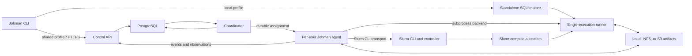

<!-- cspell:ignore Apptainer Enroot artifactauth idempotency idempotent idempotently Jobbergate mTLS Nextflow OIDC onprem parallelcluster Pcluster PostgreSQL Pyxis RBAC SkyPilot Snakemake -->
<!-- cspell:ignore sacct sbatch scancel scontrol slurm Slurm SLURM slurmctld slurmd squeue subprocesses workdir -->

# Shared and distributed execution

Status: post-v1 target design; complete initial shared-control pass implemented

Last updated: 2026-08-23

Compatibility: additive; the frozen v1 standalone contract remains valid

## 1. Purpose and status

This document specifies the target shared and distributed mode for Jobman. It
is not a claim that the complete design is implemented. The existing
[v1 specification](SPEC.md), accepted architecture decisions, persisted
schema, and platform capability record continue to govern standalone mode.

The pre-release implementation covers two bounded paths through this design:
Jobman Control owns PostgreSQL state and durable agent handshakes, while an
unprivileged `jobman-agent` accepts a native, direct-command subprocess
assignment for one named host, journals it in host-local SQLite, runs it in an
isolated helper, reports start/completion facts, and applies durable
cancellation intent. The on-premises Slurm path submits one native direct
command from a Linux per-user submit-host agent, translates portable resources,
stages a private NFS bundle, reconciles queue/accounting state and ambiguous
submission, and reports scheduler evidence. The additive, pre-release
[`jobman shared` command group](../SHARED_MODE.md) now provides target
inspection, submission, paginated job inspection, wait, cancellation, and a
private local operation journal for safely resuming uncertain submissions.
Target drain/disable transitions, capability/liveness snapshots, rotating
agent sessions, stale-observation confidence, Linux systemd user-service and
one-time OpenSSH bootstrap, local/NFS and S3 immutable regular-file staging,
Docker/Podman and Apptainer runtimes, AWS ParallelCluster provider facts and
generation rollover, transactional collections, fail-fast child policy, and
native Slurm-array compilation are also implemented. The initial control-plane
pass now adds immutable cross-target dependency graphs, quiescent completed
history import, namespace quotas, round-robin namespace dispatch, bounded
metrics, audit export, operational retention, and a persistent post-restore
assignment hold. Directory/archive staging, per-execution credential
brokering, retries, and broader policy sections below remain target
requirements rather than implemented behavior. Real on-premises and AWS
environment acceptance, recovery drills, and scale/chaos testing are still
required.

The design gives users one Jobman workload model and command-line experience
while allowing work to run on:

- the submitting host;
- a named workstation, VM, or other registered host;
- a partition on an on-premises Slurm cluster; or
- a queue/partition on an AWS ParallelCluster deployment using Slurm.

The design intentionally does not depend on SkyPilot, Jobbergate, Nextflow, or
Snakemake. A future adapter may let another tool submit a portable workload
through Jobman's public API, but no such tool owns Jobman's canonical state,
agent protocol, lifecycle, or artifact contract.

It deliberately does not turn Jobman into another cluster scheduler. Jobman
owns portable intent, orchestration, policy, authorization, and evidence.
Slurm continues to own resource allocation, queue policy, fair share,
preemption, and compute-node lifecycle.

The principal architectural decisions are:

1. **Standalone mode remains local.** It uses the current SQLite metadata
   store and local filesystem logs. Its SQLite database remains on a local
   filesystem and is never shared through NFS.
2. **Shared mode uses a control service and PostgreSQL.** PostgreSQL is the
   only authoritative shared metadata store. Clients and agents use service
   APIs and never receive database credentials.
3. **A Jobman agent is the data-plane authority on each target.** The initial
   security model is a per-user, unprivileged agent running as the operating
   system identity that will own the process or submit the Slurm job.
4. **Execution concerns remain compositional.** State, transport, execution
   backend, runtime, artifact store, placement, and grouping are separate
   dimensions with explicit compatibility checks. They are not an unrestricted
   Cartesian product.
5. **Control is at least once and execution is idempotently reconciled.** The
   system does not promise exactly-once execution across process, network, and
   scheduler failures. Ambiguous launches are surfaced as uncertain and are
   not automatically duplicated.
6. **Artifacts are not database blobs.** PostgreSQL stores manifests,
   locations, checksums, and authorization metadata. Local filesystems, NFS,
   and S3 store the bytes.
7. **AWS ParallelCluster is a Slurm target, not a separate executor.** An agent
   on an appropriate submit host uses the same Slurm adapter used on premises;
   AWS-specific configuration supplies identity, storage, networking, and
   target capabilities.

## 2. Goals, non-goals, and success criteria

### 2.1 Goals

The shared-mode work must:

- present the same core submit, inspect, log, wait, cancel, and rerun concepts
  for local processes, remote processes, and Slurm jobs;
- make all authorized shared jobs and their current state consistently visible
  from Linux VMs, Windows workstations, and cluster hosts;
- preserve a useful zero-service standalone mode;
- support PostgreSQL concurrency without exposing it directly to clients;
- use outbound agent connections so workstations and private cluster hosts do
  not require inbound control ports;
- preserve user identity and native ownership on the target;
- support native processes and policy-approved containers;
- make input and output movement explicit, inspectable, resumable, and
  independent of host-specific absolute paths;
- support one job, homogeneous collections that may compile to Slurm arrays,
  and dependency graphs without adopting a full workflow language;
- expose target capabilities and reject incompatible workloads before launch;
- survive temporary loss of the client, control service, agent connection, or
  artifact service without silently creating duplicate work; and
- allow the client/agent and control service to evolve on separate release
  cadences through versioned contracts.

### 2.2 Non-goals for the initial shared release

The first shared release will not provide:

- a distributed or replicated SQLite mode;
- direct PostgreSQL access from the CLI or agents;
- transparent synchronization or dual writes between SQLite and PostgreSQL;
- Kubernetes, AWS Batch, or arbitrary scheduler plugins;
- a privileged, multi-user agent that impersonates arbitrary operating-system
  users;
- raw SSH as the steady-state execution and monitoring protocol;
- automatic failover of work from on premises to AWS or between targets;
- a general-purpose workflow DSL, dynamic graph expansion, conditional code,
  or dataflow inference;
- interactive terminals or a promise that every v1 process operation, such as
  pause or live input, works on every backend;
- implicit copying of the submitter's current directory or environment;
- exactly-once execution of an external process or scheduler submission;
- scheduler replacement, global CPU/GPU packing, Slurm fair-share policy, or
  compute-node autoscaling; or
- an artifact proxy through the control service for bulk data.

These exclusions are boundaries, not permanent prohibitions. A future feature
must preserve the contracts and ownership rules in this document.

### 2.3 Success criteria

The design is successfully realized when all of the following are true:

- two concurrent users on different on-premises hosts observe one authorized,
  transactionally consistent shared job history;
- a Windows client can submit the same portable workload to a named Windows or
  Linux workstation, an on-premises Slurm partition, or ParallelCluster by
  changing placement rather than rewriting the command;
- disconnecting the client has no effect on accepted work;
- disconnecting an agent does not cause the control plane to assume its native
  process or Slurm job stopped, and reconnecting reconciles the same execution;
- resending every mutating API request and agent message is safe;
- a Slurm submission whose result cannot be proven is marked uncertain rather
  than silently resubmitted;
- each state-changing decision identifies the principal, namespace, target,
  effective workload, and execution identity in an audit trail;
- inputs and outputs can be traced from logical artifact name to content
  digest and physical location; and
- standalone users can continue to use the frozen v1 behavior without running
  PostgreSQL, a control service, or an agent service.

## 3. Normative language and terminology

The words **MUST**, **MUST NOT**, **SHOULD**, **SHOULD NOT**, and **MAY** are
normative requirements in this document.

| Term | Meaning |
| --- | --- |
| Workload | An immutable, portable declaration of command, runtime, resources, artifacts, and execution policy. |
| Job | A durable submission of a workload in a namespace, including placement and policy. |
| Run | One Jobman-controlled attempt of a job. A Jobman retry creates a new run. |
| Execution | The one accepted binding of a run to a target and native process or scheduler object. |
| Assignment | An idempotently delivered request for an agent to accept an execution. |
| Native ID | A process identity or scheduler job/task ID, meaningful only with a target generation. |
| Target | A configured placement destination with identity, policy, and advertised capabilities. |
| Agent | An unprivileged Jobman service that accepts assignments and controls work as one target-side user. |
| Runner | A private, single-execution helper that owns process-tree, staging, logging, and result duties. |
| Control plane | The shared API and coordinator backed by PostgreSQL. |
| Artifact | A declared input, output, log, or manifest whose bytes live outside the metadata database. |
| Namespace | The authorization, ownership, naming, quota, and audit boundary for shared resources. |

### 3.1 Invariants

The implementation MUST preserve these invariants:

1. Every shared resource belongs to exactly one namespace.
2. Every run has at most one accepted execution.
3. Assignment redelivery uses the same execution ID and cannot create another
   accepted execution.
4. A lease expiration means ownership or observations are stale; it does not
   prove an external process or Slurm job has stopped.
5. Jobman retry and Slurm requeue are different. A Jobman retry creates a new
   run and native submission; a Slurm requeue remains the same execution.
6. The command's factual exit result is immutable once known. Later output
   publication failure may change the effective run outcome, but not the
   recorded process fact.
7. A physical path is interpreted only in the context of a target and artifact
   mapping. No client-supplied absolute path is assumed portable.
8. Artifact bytes do not pass through PostgreSQL.
9. Secret values are not persisted in workload specifications, events, logs,
   or diagnostic output.
10. No automatic retry follows an ambiguous native launch unless the workload
    explicitly opts into duplicate risk and policy permits it.

## 4. Compositional capability model

Jobman exposes the following independent design dimensions:

| Dimension | Required implementations |
| --- | --- |
| State | SQLite, PostgreSQL |
| Execution backend | Subprocess, Slurm |
| Control transport | Local, agent API, SSH bootstrap, Slurm CLI |
| Runtime environment | Native process, container |
| Artifact store | Local filesystem, NFS, S3 |
| Placement | Local host, named remote host, Slurm cluster and optional partition |
| Grouping | Single job, collection/array, dependency graph |

These labels describe different hops and MUST NOT be flattened into one
`executor` interface:

- **Local transport** connects a standalone command to its local store and
  local execution components.
- **Agent API transport** connects the shared control plane to a registered
  target-side agent.
- **SSH bootstrap transport** installs, starts, or enrolls an agent. It ends
  before ordinary job control begins.
- **Slurm CLI transport** connects a local controller or agent to Slurm. It is
  an adapter beneath the Slurm execution backend, not a client-to-service API.

Similarly, placement selects *where*, the backend selects *who allocates or
launches*, the runtime selects *how the payload is isolated*, and the artifact
store selects *where bytes persist*.

### 4.1 Supported composition profiles

The implementation MUST validate a resolved composition before accepting an
execution. The initial supported profiles are:

| Mode | State | Control path | Backend | Placement | Artifact stores | Runtime |
| --- | --- | --- | --- | --- | --- | --- |
| Standalone process | SQLite | Local | Subprocess | Local host | Local, reachable NFS | Native; local container when advertised |
| Standalone Slurm | SQLite | Local, then Slurm CLI | Slurm | One configured Slurm cluster/partition | Reachable NFS; S3 when configured | Native; cluster container when advertised |
| Shared host | PostgreSQL | Service to agent API | Subprocess | Named registered host | Host-local, NFS, S3 | Native; host container when advertised |
| Shared Slurm | PostgreSQL | Service to agent API, then Slurm CLI | Slurm | Named cluster/partition | NFS, S3; submit-host local only for staging | Native; cluster container when advertised |

Standalone Slurm is a useful compositional result, but it is not required for
the first shared-mode milestone. Shared local-host execution means execution by
a registered agent on that host; the CLI does not bypass the shared control
plane after a shared job has been created.

Unsupported combinations MUST fail during validation with the missing target
capability and a suggested compatible choice. Jobman MUST NOT silently change
the requested target, runtime, resource request, or artifact store.

## 5. System architecture



The diagram shows logical ownership, not a required one-process-per-box
deployment. The API and coordinator should initially be roles of one
`jobman-control` binary. They may run together for a department deployment and
scale as separate process roles later without changing external contracts.

### 5.1 Standalone mode

Standalone mode retains the current daemonless product:

- the CLI and per-job supervisors use the local SQLite store;
- SQLite and its WAL files MUST be on one host's local filesystem;
- local filesystem logs remain the default artifact implementation;
- the current operating-system user is the identity and namespace boundary;
  and
- no shared service, PostgreSQL server, or registered agent is required.

NFS may hold workload inputs or outputs when the operating system and site
configuration provide the necessary semantics. It MUST NOT hold the
WAL-mode SQLite state database. SQLite documents that WAL requires all clients
to be on the same host and does not work over a network filesystem.

### 5.2 Shared mode

Shared mode consists of:

- one or more stateless control API/coordinator instances;
- one highly available PostgreSQL deployment;
- one per-user agent for each user/target binding that may execute work;
- zero or more short-lived runners; and
- configured local, NFS, or S3 artifact stores.

All clients observe shared state through the API. This, rather than placing a
database file in a common home directory, provides consistent state to the
department's cluster hosts, VMs, and Windows workstations.

The control service owns durable intent and global policy. An agent owns
target-side facts. The control service MUST NOT claim that a process exited,
that a Slurm job vanished, or that a file was published unless an authoritative
target observation or a reconciliation rule supports that statement.

### 5.3 Ownership boundaries

| Concern | Authoritative owner |
| --- | --- |
| Shared job, group, dependency, retry, placement, and cancel intent | Control plane and PostgreSQL |
| Namespace membership, authorization, quotas, and audit | Control plane and PostgreSQL |
| Assignment eligibility and dependency readiness | Coordinator |
| Native process tree, local timeout enforcement, staging, and local evidence | Agent/runner |
| Queueing, allocation, preemption, and native scheduler state | Slurm |
| Artifact bytes and object durability | Selected artifact store |
| Artifact identity, manifest, checksum, and authorization | Control plane and PostgreSQL |
| Standalone lifecycle and policy | Existing local supervisor and SQLite store |

The PostgreSQL server's clock is authoritative for control-plane leases,
deadlines, and ordering. A runner uses a monotonic target clock for an active
process timeout. Clock skew MUST be recorded and monitored; agents MUST NOT
authoritatively advance a shared deadline using their wall clock.

## 6. Repository and deployable boundaries

### 6.1 Recommended repositories

The project should use two repositories initially.

#### Existing `jobman` repository: edge and data plane

The existing repository should build:

- `jobman`, the CLI and standalone product;
- `jobman-agent`, the shared target-side service; and
- a private runner entry point or binary used for one subprocess or Slurm
  allocation.

It should own:

- the portable workload and wire-contract types;
- published JSON Schema, OpenAPI inputs, compatibility fixtures, and contract
  tests;
- standalone SQLite persistence and migration;
- the cross-platform subprocess backend and process-tree implementation;
- the Slurm CLI driver and safe batch-script renderer;
- native and container runtime adapters;
- artifact staging, path mapping, checksums, and local spool primitives;
- SSH bootstrap and agent client behavior; and
- platform-specific Linux, macOS, and Windows target behavior.

Keeping the agent with the CLI avoids duplicating the most security-sensitive
process, logging, filesystem, and platform code. Shared-only dependencies MUST
remain behind cohesive packages so standalone builds and tests do not require a
running service.

#### New `jobman-control` repository: control plane

The service repository should build one `jobman-control` binary with API and
coordinator roles. It should own:

- PostgreSQL schema migrations and persistence repositories;
- the public client API and private agent API server;
- OIDC login integration, agent enrollment, mTLS certificate lifecycle,
  namespaces, RBAC, and target identity mappings;
- target registry, capability snapshots, assignment and reconciliation queues;
- shared lifecycle, retry, placement, collection, and graph orchestration;
- artifact metadata authorization and short-lived transfer grants;
- audit, administrative operations, metrics, and service deployment assets;
  and
- backup, restore, upgrade, and high-availability runbooks.

API and coordinator roles should share one domain model and migration stream.
They MUST NOT be split into independently writable microservices at the start.

#### Contract ownership

The canonical workload schema, event envelope, API schemas, state vocabulary,
and conformance fixtures should live in a dependency-light public package and
`api/` tree in the `jobman` repository. Tagged releases publish these artifacts.
`jobman-control` consumes an explicit compatible version and runs the same
fixtures.

This avoids a third repository and its release choreography while preserving a
language-neutral contract. The contract package MUST NOT import CLI, SQLite,
platform, agent, or service implementation packages. If that boundary becomes
impossible to maintain, it may later be extracted without changing the
published schema identifiers.

The repositories MUST NOT share:

- SQL queries or a generic cross-database SQL dialect layer;
- private service domain objects;
- database migrations;
- process-global configuration; or
- assumptions that both binaries are upgraded atomically.

They SHOULD share behavior through schemas, narrow generated clients, and
black-box conformance tests. The service should support at least the current
and immediately previous released agent protocol, with capability negotiation
for optional features.

### 6.2 Why not one repository per adapter

Subprocess, Slurm, container, local filesystem, NFS, and S3 implementations are
small data-plane adapters around one execution contract. Separate repositories
would create version skew without establishing a useful security or deployment
boundary. They should remain packages in `jobman` until an adapter has a truly
independent release or trust model.

There should initially be no separate artifact service. Agents and runners
transfer bytes directly to NFS or S3 using bounded credentials; the control
plane only authorizes transfers and records manifests. Deployment manifests,
database setup, and service runbooks should live in `jobman-control` rather
than a third operations repository until operational ownership requires one.

### 6.3 Internal package boundaries

The implementation should separate policy from effects with narrow consumer-
defined interfaces. Illustrative boundaries are:

```text
jobman repository
  api/ or pkg/protocol/       immutable external contracts
  internal/workload/          validation and resolution
  internal/lifecycle/         state transition rules
  internal/execution/         execution coordinator contract
  internal/backend/process/   subprocess implementation
  internal/backend/slurm/     Slurm CLI implementation
  internal/runtime/native/    native runtime
  internal/runtime/container/ container runtime adapters
  internal/artifact/          manifests and staging engine
  internal/agent/             sessions, assignments, spool, reconciliation
  internal/bootstrap/ssh/     OpenSSH-based bootstrap
  internal/store/sqlite/      standalone repository

jobman-control repository
  internal/api/               client and agent HTTP handlers
  internal/auth/              OIDC, RBAC, credentials
  internal/domain/            shared lifecycle and policy
  internal/coordinator/       dependency, retry, placement, assignment
  internal/store/postgres/    PostgreSQL repositories and migrations
  internal/artifactauth/      manifests and transfer grants
  internal/audit/             append-only administrative evidence
```

These are responsibility boundaries, not mandated package names. In
particular, SQLite and PostgreSQL should implement equivalent domain semantics
where required, but should not be forced through an abstraction that hides
their different transaction and deployment models.

## 7. Requirements

### 7.1 State and consistency requirements

- **STATE-01:** Standalone mode MUST support the existing SQLite state backend
  and MUST keep its database on a host-local filesystem.
- **STATE-02:** Shared mode MUST use PostgreSQL as its authoritative metadata
  backend and MUST support concurrent API and coordinator instances.
- **STATE-03:** The CLI and agents MUST access shared state only through
  authenticated APIs; database credentials MUST be confined to control-plane
  services and migration tooling.
- **STATE-04:** Mutations MUST use unique constraints, revisions, or compare-
  and-swap transitions so concurrent decisions cannot both succeed.
- **STATE-05:** State transitions and the outbox messages caused by them MUST
  commit atomically in one PostgreSQL transaction.
- **STATE-06:** External calls, artifact transfers, Slurm commands, and agent
  calls MUST NOT occur while a database transaction is open.
- **STATE-07:** SQLite and PostgreSQL histories MUST NOT be dual-written or
  automatically merged. Import/export is an explicit, offline operation.
- **STATE-08:** A restored PostgreSQL database MUST trigger target and artifact
  reconciliation before uncertain work is retried or declared lost.

### 7.2 Execution and transport requirements

- **EXEC-01:** The subprocess backend MUST preserve argument boundaries and
  MUST NOT invoke a shell unless the workload explicitly selects a shell.
- **EXEC-02:** The Slurm backend MUST submit, query, cancel, and reconcile
  through structured Slurm CLI invocations on a configured submit host.
- **EXEC-03:** Agents MUST initiate outbound, authenticated connections to the
  control service; ordinary operation MUST NOT require an inbound agent port.
- **EXEC-04:** Assignment, action, event, log-chunk, and completion messages
  MUST have stable idempotency identities and tolerate redelivery.
- **EXEC-05:** An agent MUST durably record an assignment and receive the
  control plane's successful acceptance result before launching native work.
- **EXEC-06:** SSH MUST be limited to bootstrap, repair, enrollment, and
  optional one-shot agent startup. All durable job control after enrollment
  MUST use the agent API.
- **EXEC-07:** A native identifier MUST be stored with target ID, target
  generation, backend, and submission identity; a bare PID or Slurm job ID is
  insufficient.
- **EXEC-08:** Backend capability differences MUST be explicit. Unsupported
  pause, resume, live input, networking, or container features MUST return a
  stable unsupported-capability result.

### 7.3 Runtime requirements

- **RUN-01:** Native process and container runtimes MUST implement the same
  logical command, environment, working-directory, artifact, and result
  contract.
- **RUN-02:** Target capability records MUST identify supported container
  engines, versions, image reference forms, GPU integration, and mount rules.
- **RUN-03:** Local or named hosts MAY advertise Docker or Podman. Slurm targets
  MAY advertise site-supported Apptainer or Pyxis/Enroot integrations.
- **RUN-04:** Image digests SHOULD be required by namespace policy for
  reproducibility. Mutable tags MUST resolve to and record an observed digest
  when the runtime exposes one.
- **RUN-05:** User mounts MUST be derived from declared artifact mappings and
  administrator allowlists. A workload MUST NOT mount arbitrary host paths
  outside allowed roots.
- **RUN-06:** Runtime-specific options MUST use namespaced extension fields,
  target allowlists, and persisted effective values; they MUST NOT silently
  alter portable fields.

### 7.4 Artifact requirements

- **ART-01:** Jobman MUST support local filesystem, named NFS, and S3 artifact
  stores through one logical manifest model.
- **ART-02:** Inputs, outputs, logs, and diagnostic evidence MUST have logical
  names independent of their physical paths.
- **ART-03:** Input manifests SHOULD identify immutable content by checksum.
  Output publication MUST calculate and record size and checksum unless policy
  explicitly disables it for an oversized object.
- **ART-04:** Stage-in, execute, stage-out, and publish MUST be separate durable
  phases with independently visible errors.
- **ART-05:** Interrupted transfers MUST be resumable when the store supports
  it or safely restartable into a new temporary location.
- **ART-06:** Path traversal, unsafe symlinks, special files, unexpected output
  volume, and namespace escape MUST be rejected or bounded by policy.
- **ART-07:** PostgreSQL MUST contain artifact metadata and pointers only, not
  bulk stdout, stderr, input, or output data.
- **ART-08:** A successful process followed by failed required-output
  publication MUST retain the process exit fact and produce an effective
  artifact/publication failure outcome.

### 7.5 Placement and grouping requirements

- **PLACE-01:** Placement MUST support the current local host, a stable named
  agent host, and a stable Slurm cluster with an optional partition.
- **PLACE-02:** Shared targets MUST have immutable IDs and changing generation
  IDs so deletion/recreation cannot cause old native IDs to identify new work.
- **PLACE-03:** The effective target, partition, backend, runtime, capability
  snapshot, resource mapping, and artifact path mapping MUST be persisted for
  every accepted execution.
- **PLACE-04:** Target selection MUST be explicit or derived from a visible,
  persisted namespace default. Jobman MUST NOT silently fail over between
  on-premises and AWS targets.
- **GROUP-01:** A single job MUST remain the atomic unit of lifecycle, retry,
  cancellation, logs, and authorization.
- **GROUP-02:** A collection MUST create an addressable child Jobman job for
  each item, expose aggregate status and concurrency limits, and remain correct
  when not implemented as a native array.
- **GROUP-03:** A homogeneous Slurm collection MAY compile to a Slurm job array,
  but array task order MUST NOT be treated as execution order and each child
  MUST retain an independent Jobman identity and outcome.
- **GROUP-04:** A dependency graph MUST be immutable after acceptance, reject
  cycles, identify explicit outcome predicates, and be orchestrated by the
  control plane across targets.
- **GROUP-05:** Slurm native dependencies MAY optimize a same-target graph but
  MUST NOT become the authoritative graph state.

### 7.6 Identity and security requirements

- **AUTH-01:** Shared human identity MUST use the OIDC issuer and subject pair,
  not a mutable username or email address.
- **AUTH-02:** Every shared resource and API operation MUST be namespace scoped
  and authorization checked.
- **AUTH-03:** Agent identity MUST be a separate service principal established
  by one-time enrollment and a rotating mTLS credential.
- **AUTH-04:** Initial agents MUST run per user under the target operating-
  system account that owns the process, NFS files, and Slurm submission.
- **AUTH-05:** Mapping from a human principal to target operating-system user,
  Slurm account/QOS, and optional AWS role policy MUST be explicit,
  administrator-controlled, and auditable.
- **AUTH-06:** The service MUST NOT store SSH private keys. SSH bootstrap MUST
  use the user's OpenSSH client, configuration, agent, and host-key policy.
- **AUTH-07:** Secret references MAY be persisted; resolved secret values MUST
  be delivered only to the assigned runtime, be redacted from evidence, and
  use short-lived credentials where possible.
- **AUTH-08:** Authorization, enrollment, target administration, cancellation,
  artifact access, and secret resolution MUST emit immutable audit records.

### 7.7 Operability and compatibility requirements

- **OPS-01:** Protocols MUST be versioned and support capability negotiation.
  The service SHOULD support the current and previous agent protocol versions.
- **OPS-02:** PostgreSQL migrations MUST be forward-only, transactional when
  possible, observable, and tested against every supported upgrade origin.
- **OPS-03:** Agents MUST have a bounded durable local spool for accepted
  assignments, events, logs, and completion records during service outages.
- **OPS-04:** The service MUST expose health, readiness, queue age, assignment
  age, agent freshness, reconciliation, transfer, and error metrics without
  exposing workload secrets.
- **OPS-05:** Service backup and point-in-time recovery, certificate rotation,
  audit retention, agent upgrade, and target drain procedures MUST be
  documented before production use.
- **OPS-06:** Resource and API limits MUST bound workload size, graph size,
  collection expansion, log rate, artifact count/bytes, retry count, request
  duration, and local spool use.

## 8. Portable workload and submission specifications

### 8.1 Separation of workload from submission

A portable workload describes what to run. A submission describes who owns
this use of the workload, where it should run, and how it participates in a
group. They MUST be separately versioned objects:

- `Workload` is immutable and reusable. It contains command, runtime,
  environment references, resources, artifacts, and execution policy.
- `JobRequest` binds a workload or immutable workload digest to a namespace,
  placement, optional parameter values, and optional collection or graph node.
- `EffectiveExecution` is a server-generated, immutable snapshot after target
  defaults, identity bindings, path mappings, policy, and capabilities have
  been resolved. It is the specification an agent signs for and executes.

This separation lets a user submit one workload to a workstation, on-premises
Slurm, or ParallelCluster without modifying the workload document. A target-
specific field may be expressed as a constrained extension, but it reduces the
set of compatible targets and is visible during validation.

The authoring form MAY be YAML. The canonical persisted and hashed form MUST be
deterministic JSON with a published JSON Schema. Unknown fields MUST be
rejected. Defaults MUST be materialized before hashing, and map ordering or
insignificant authoring syntax MUST NOT alter the digest.

### 8.2 Workload fields

The first portable workload schema must include:

| Area | Required semantics |
| --- | --- |
| Metadata | Schema version, optional name/description, labels, annotations that do not affect execution |
| Command | Executable, exact argument vector, optional explicit shell mode |
| Working directory | Logical sandbox path, not an arbitrary host absolute path |
| Environment | Explicit non-secret values, secret references, target-defined environment profile |
| Resources | CPU, memory, GPU, nodes/tasks, temporary storage, wall time, and portable constraints |
| Runtime | Native or container; image reference/digest, entry point policy, pull policy, network policy, user policy |
| Artifacts | Declared immutable inputs, expected outputs, logs, logical paths, checksums, retention hints |
| Policy | Run timeout, retry bounds/backoff, cancellation grace, duplicate-risk/idempotency declaration |
| Requirements | Required operating systems, architectures, backend/runtime capabilities, and optional features |
| Extensions | Namespaced, policy-allowlisted backend options that are preserved in the effective snapshot |

There is no implicit inheritance of the submitting process's full environment
in shared mode. A target may provide a named, administrator-controlled baseline
environment profile. The effective profile name and version MUST be persisted.
Explicit workload values override only keys that policy permits.

The command is always represented as an executable and an argument array. An
explicit shell form must identify the shell capability, such as `posix-sh` or
`powershell`, and remains target constrained. Jobman MUST NOT join ordinary
arguments into a shell string.

Portable resource fields define user intent, not scheduler flags. A resolver
maps them to local limits or Slurm options and persists the mapping. Backend
extensions are an escape hatch for capabilities such as a Slurm constraint or
reservation; target policy must validate every extension name and value.
Slurm account, QOS, and execution user normally come from the target identity
binding rather than an untrusted workload field.

### 8.3 Logical paths

The portable schema defines virtual roots rather than a universal physical
root:

- `workspace:/` for the initial working tree;
- `inputs:/<name>/` for staged input artifacts;
- `outputs:/` for declared results; and
- `scratch:/` for execution-scoped temporary data.

The runtime maps these roots to safe host paths and exposes their resolved
values through documented Jobman environment variables. In the command view,
the input, output, and scratch roots are also exposed as `inputs`, `outputs`,
and `scratch` beneath the workspace root. A target/runtime that cannot provide
that view does not satisfy this portable-path capability. Artifact source and
destination paths are relative to the appropriate root. Relative command
arguments remain the most portable form; an application that embeds operating-
system-specific paths must declare corresponding platform requirements.

Standalone compatibility may translate the current absolute working directory
into a target-local workload, but the CLI MUST warn that such a workload is not
portable. A `jobman workload validate --target ...` or equivalent dry-run
operation should report path, runtime, resource, and extension incompatibilities
without creating a job.

### 8.4 Illustrative authoring form

The exact spelling remains subject to schema review, but the contract should
have the following shape:

```yaml
apiVersion: jobman/v1alpha1
kind: Workload
metadata:
  name: train-model
  labels:
    project: example
spec:
  command:
    executable: python
    args:
      - train.py
      - --input
      - inputs/dataset/data.parquet
      - --output
      - outputs/model
  workingDirectory: workspace:/
  environment:
    profile: python-research-v3
    values:
      OMP_NUM_THREADS: "4"
    secrets:
      - name: experiment-token
        source: secret://research/experiment-token
        exposeAs:
          environment: EXPERIMENT_TOKEN
  resources:
    cpu: 4
    memory: 16GiB
    gpu: 1
    nodes: 1
    tasks: 1
    wallTime: 2h
  runtime:
    kind: container
    container:
      image: registry.example.edu/research/trainer@sha256:0123456789abcdef
      pullPolicy: if-not-present
      network: restricted
  artifacts:
    inputs:
      - name: dataset
        source: artifact://department-data/training/v4
        target: inputs:/dataset
        checksum: sha256:89abcdef01234567
    outputs:
      - name: model
        source: outputs:/model
        destination: artifact://research-results/models
        required: true
  policy:
    runTimeout: 2h15m
    retry:
      maxRuns: 3
      backoff: 5m
    duplicateRisk: reject
  requirements:
    architectures: [amd64]
    capabilities: [gpu]
  extensions:
    slurm:
      constraint: a100
```

The abbreviated digests in this example are illustrative, not valid production
digests. A corresponding `JobRequest` supplies placement:

```yaml
apiVersion: jobman/v1alpha1
kind: JobRequest
metadata:
  namespace: cancer-research
  name: training-2026-08-22
spec:
  workload: ./train-model.yaml
  placement:
    target: aws-parallelcluster
    partition: gpu
```

The CLI resolves a local file to canonical workload JSON before submission.
The server persists the original workload digest, the submitted placement, and
the effective execution snapshot. A later target configuration change MUST NOT
rewrite an accepted execution.

## 9. Shared lifecycle and consistency model

### 9.1 Durable entities

The shared model contains these relationships:

```text
namespace
  workload revision
    job
      run 1
        execution
      run 2 (Jobman retry)
        execution

collection
  member -> job

dependency graph
  node -> job
  edge -> node outcome predicate
```

A job holds durable policy and grouping identity. A run is one logical Jobman
attempt. An execution receives its ID before assignment and is redelivered with
that same ID until accepted or safely abandoned. Once an agent's acceptance is
committed, the control plane MUST NOT assign that execution elsewhere merely
because its lease or connection expires.

An agent follows this launch handshake:

1. Receive an assignment with execution ID and effective-spec digest.
2. Validate local capabilities and durably journal the assignment.
3. Call the acceptance API with execution ID, agent ID, target generation, and
   digest.
4. The service performs a compare-and-swap acceptance in PostgreSQL and returns
   the already-recorded result on duplicate requests.
5. Only after a successful acceptance response may the agent stage or launch
   native work.

This prevents a lost response from causing reassignment: the agent retries the
same acceptance. It does not eliminate scheduler ambiguity after the agent has
started an external `sbatch`; that case requires backend reconciliation.

### 9.2 State dimensions

One overloaded `status` is insufficient in a distributed system. The database
MUST retain at least:

- **desired state**: run, cancel, or administratively stop;
- **orchestration phase**: dependency wait, ready, assigning, accepted,
  staging in, submitted, running, staging out, publishing, retry wait, or
  terminal;
- **native observation**: backend-specific queued/running/suspended/terminal
  state and native reason;
- **observation confidence**: current, stale, uncertain, or lost;
- **process result**: exit code, signal/exception, start and end facts;
- **artifact result**: input and output transfer/publication facts; and
- **effective outcome**: success, failure, timed out, cancelled, aborted, lost,
  submission failed, or artifact failed.

The public CLI may project these dimensions into the familiar v1 phases and
outcomes, but machine-readable output must expose the independent fields.
Native scheduler reason strings are evidence, not Jobman lifecycle values.

Every event has a source, source-local monotonic sequence, event ID, observed
time, ingested time, and payload schema version. A unique constraint on source,
execution, and sequence makes replay safe. Server-generated transitions use a
row revision and append a state event in the same transaction.

### 9.3 Retry and uncertainty policy

Jobman decides retries from the immutable run result and retry policy. It MUST
not treat these as retryable proof by themselves:

- loss of an agent heartbeat;
- an expired assignment or execution lease;
- a timeout querying Slurm;
- absence from `squeue` before accounting history is checked;
- a service restart; or
- an `sbatch` call whose output was lost after submission may have succeeded.

Such cases enter reconciliation with `uncertain` confidence. An administrator
or policy may eventually mark work lost after target-specific evidence and a
bounded reconciliation period. Automatic duplicate-risk execution is disabled
by default. If a future policy permits it, the workload must declare itself
idempotent, the audit trail must identify the decision, and the UI must retain
the earlier ambiguous native identity.

Timeout ownership is explicit:

- the coordinator owns whole-job, dependency, and retry deadlines;
- the runner owns active process run timeouts and termination escalation;
- Slurm owns its configured wall-time enforcement; and
- the effective run ends according to the earliest applicable authoritative
  deadline, without rewriting which component observed termination.

### 9.4 Mapping existing Jobman policy into shared mode

The shared design preserves existing policy concepts while moving each effect
to the component that can enforce it safely:

- absolute delay, whole-job timeout, retry backoff, run-count policy, and
  Jobman dependency predicates are evaluated by the coordinator from database
  time and committed state;
- active subprocess timeout and termination escalation are enforced by the
  runner, while Slurm wall time is also submitted as a scheduler limit;
- namespace and Jobman target concurrency are admission policy in PostgreSQL,
  while Slurm limits and fair share remain scheduler policy;
- target file/probe wait conditions require explicit placement and an agent-
  side condition evaluation; the control service never executes an arbitrary
  probe itself;
- a path-based wait is target constrained unless it names a logical artifact,
  and a probe command follows the same exact-argument, identity, timeout, log,
  and authorization rules as other target-side code; and
- notification decisions arise from committed control-plane transitions and a
  transactional outbox. Delivery workers use bounded, namespace-approved
  providers and record attempts without rewriting the job result.

The initial shared release MAY support only time, Jobman dependency, and
logical-artifact wait conditions. Any unsupported v1 local condition must fail
portable validation rather than running on the control-service host or being
silently ignored.

## 10. Control plane and PostgreSQL design

### 10.1 Service API

The client API should be versioned REST/JSON over TLS with a published OpenAPI
description. Initial resource groups are:

- workloads and workload revisions;
- jobs, runs, executions, actions, events, and logs;
- collections, graph definitions, nodes, and edges;
- targets, partitions, capabilities, and placement validation;
- artifacts, manifests, locations, and transfer grants;
- namespaces, memberships, roles, target bindings, and audit records; and
- agents, enrollment tokens, sessions, versions, and health.

Mutating client requests MUST accept an idempotency key scoped to principal,
namespace, operation, and canonical request digest. Reuse with a different
digest MUST fail. Resource updates use revisions or HTTP entity tags. Long
operations return durable operation identities rather than holding one request
open until execution completes.

Default lifecycle reads and all mutations use the PostgreSQL primary or an
equivalent session-consistent path. After a mutation response identifies a
committed revision, a subsequent authorized read through any API instance MUST
not return an older revision. Service caches and read replicas may accelerate
explicitly stale-tolerant history/search operations, but cannot drive control
decisions or the default status view. Target observations remain naturally
eventual and always expose observation and ingestion times.

Machine output MUST use stable identifiers and enums. Human diagnostics may
include native reason text but MUST not make scripts parse localized Slurm or
operating-system messages.

### 10.2 Coordinator

The coordinator is a horizontally scalable role that:

- evaluates graph and collection readiness;
- applies namespace and target concurrency/queue limits;
- resolves placement against fresh capability snapshots;
- materializes effective executions;
- creates and expires unaccepted assignments;
- creates desired cancellation and retry actions;
- reconciles stale observations; and
- publishes transactional outbox messages.

Multiple instances coordinate through PostgreSQL row transitions and queue
claims. `FOR UPDATE SKIP LOCKED` is appropriate for competing workers claiming
already-ordered queue rows; PostgreSQL explicitly describes it as suitable for
queue-like consumers and not for a general consistent view. It MUST NOT be the
fairness algorithm. Namespace/target fairness, quotas, priorities, and stable
tie breaking are domain policy materialized before or during claim.

PostgreSQL `LISTEN`/`NOTIFY` MAY reduce latency but MUST be treated only as a
wake-up hint. Durable rows and periodic scans remain authoritative.

An external message broker is not required initially. Assignments, desired
actions, and outbox records remain durable in PostgreSQL and are delivered by
API/coordinator workers. If a broker is later introduced for scale, it is a
transport that permits redelivery; it does not become authoritative state and
consumers still apply the same idempotency rules.

### 10.3 Initial relational model

The initial schema should use ordinary typed columns for queryable lifecycle
state and JSONB only for immutable specifications, snapshots, and versioned
payloads. Expected tables include:

| Area | Representative tables |
| --- | --- |
| Identity | `principals`, `namespaces`, `memberships`, `role_bindings`, `target_identity_bindings` |
| Targets | `targets`, `target_generations`, `partitions`, `agents`, `agent_sessions`, `capability_snapshots` |
| Work | `workloads`, `workload_revisions`, `jobs`, `runs`, `executions`, `assignments`, `desired_actions` |
| Groups | `collections`, `collection_members`, `graphs`, `graph_nodes`, `graph_edges` |
| Evidence | `state_events`, `native_observations`, `audit_events`, `notification_attempts` |
| Artifacts | `artifacts`, `artifact_locations`, `artifact_manifests`, `transfer_attempts`, `log_streams` |
| Delivery | `outbox`, `idempotency_records`, `coordinator_work` |

Every tenant-owned table MUST carry `namespace_id` directly or have a
database-enforced path to it. Important constraints include:

- one accepted execution per run;
- unique assignment delivery identity;
- unique event source sequence;
- unique native identity within target generation and backend, allowing for
  documented Slurm array-task identity;
- unique idempotency key and request digest scope; and
- graph-edge and collection-member uniqueness.

Short transactions, explicit lock ordering, bounded connection pools, and
retry of classified serialization/deadlock errors are required. External I/O
never occurs in a transaction. Audit and high-volume event tables may be time
partitioned for retention, but the current lifecycle snapshot remains compact.

Row-level security MAY provide defense in depth. Application authorization is
still mandatory and tests MUST assume that an application bug can otherwise
cross a namespace. Database roles for runtime, migration, backup, and read-only
operations must be separate and least privileged.

### 10.4 Durability and recovery

The production PostgreSQL deployment requires encrypted connections, automated
backups, tested point-in-time recovery, monitoring, capacity planning, and a
documented supported-version policy. Restoring metadata to an earlier time can
make actual target work newer than the database. Therefore restore completion
places active targets into reconciliation mode and blocks automatic relaunch
until agents and Slurm accounting have reported their native facts.

There is no online SQLite-to-PostgreSQL replication. A migration tool may
export immutable completed history, workload specifications, and artifact
pointers from a quiescent standalone store, then import them under a namespace
with provenance. It MUST NOT migrate an active job or reuse a local job ID as a
shared primary key.

## 11. Agent and control transports

### 11.1 Agent security model

The initial production agent is a per-user, unprivileged service:

- on Linux it normally runs as a systemd user service or equivalent;
- on Windows it runs in the user's session or as an appropriately configured
  per-user service/task; and
- on a Slurm submit host it runs as the Unix account whose Slurm jobs and NFS
  files it owns.

This model lets the operating system, NFS, and Slurm enforce the same identity
users already have. A root service that accepts an arbitrary username and
executes through `sudo` is explicitly excluded. A future multi-user agent would
need a small audited privilege-separation broker, immutable identity mapping,
site-specific review, and a separate threat model.

An agent has its own service principal, target binding, and certificate. It may
only receive work for authorized user/namespace/target mappings. Compromise of
one agent credential should not grant another user's assignments or general
control-plane administration.

### 11.2 Enrollment and session protocol

Enrollment proceeds as follows:

1. An authorized user or administrator creates a short-lived, single-use token
   bound to a target record, expected user, and allowed namespace(s).
2. The agent generates its key locally and presents the token, key proof,
   package version, host facts, and target generation.
3. The service validates the binding and issues a short-lived, renewable mTLS
   certificate. Private key material never leaves the target.
4. The agent establishes an outbound HTTPS session and publishes a signed
   capability snapshot.
5. Renewal rotates credentials before expiry; revocation and target drain stop
   new assignments without assuming existing work stopped.

Agent communication can use lease-based long polling initially. WebSockets or
another streaming transport may later reduce latency but must preserve the
same durable message semantics. Required operations are:

- open/renew session and report capabilities/health;
- poll and claim assignments;
- accept or reject an execution with structured reasons;
- publish ordered events, native observations, results, and committed log-chunk
  metadata after placing chunk bytes in the granted artifact store;
- poll desired actions and acknowledge their target-side effects;
- request artifact grants or report direct-store locations; and
- submit a reconciliation inventory after reconnect, restart, or restore.

The agent keeps a bounded, host-local durable spool. This spool may use SQLite
on the local disk as an implementation detail, but is not authoritative shared
state and MUST NOT live on NFS. Capacity policy determines whether the agent
applies backpressure to log capture, pauses new acceptance, or marks log
truncation; it must never silently discard a terminal result.

### 11.3 Runner model

For subprocess execution, the agent starts one private runner per execution.
The runner:

- verifies the effective-spec digest and execution identity;
- prepares a private sandbox and stages inputs;
- starts the native process or container with exact argument boundaries;
- owns the process group or Windows Job Object;
- captures stdout/stderr ordering as far as the platform permits;
- enforces active run timeout and termination escalation;
- stages and publishes outputs; and
- atomically writes a local completion manifest before reporting it.

The runner has a bounded shutdown path and durable local identity evidence.
Agent restart must reconnect to a living runner where safe or reconcile its
completion manifest. PID reuse alone is never sufficient evidence of identity.

For Slurm, a batch wrapper starts a runner inside the allocation. The submit-
host agent monitors Slurm and consumes the runner's result manifest. The
manifest may travel through NFS, S3, or an outbound runner connection according
to target capabilities; compute nodes are not assumed to accept inbound
connections or even have internet access.

### 11.4 SSH bootstrap

SSH bootstrap should call the user's installed OpenSSH tools so existing
configuration, jump hosts, hardware-backed keys, credential agents, and strict
host-key checking remain effective. The bootstrap command must:

- preflight platform, architecture, control-service reachability, and existing
  agent state;
- transfer or select a versioned, checksum/signature-verified package;
- install only in an authorized user location unless an administrator performs
  a separately explicit system installation;
- create/start the per-user service with a one-time enrollment token;
- wait for the service to report the expected agent ID and version; and
- delete or invalidate transient enrollment material.

The service never receives or stores the SSH private key, and agent forwarding
must not be enabled implicitly. Arbitrary remote shell strings are out of scope.
After successful enrollment, submission, logs, cancellation, and reconciliation
all use the agent API. An optional ephemeral one-shot agent can be designed
later, but it must use the same acceptance, evidence, and identity contracts.

## 12. Execution backends and runtime adapters

### 12.1 Subprocess backend

The subprocess backend extends the current platform-aware execution work. It
must retain process-group/Job-Object ownership, signal and termination policy,
exit-code fidelity, terminal-hangup independence, and bounded I/O. Shared mode
adds a runner sandbox, artifact staging, agent journal, and service event
delivery; it should not create a second process-control implementation.

Local resource declarations are admission constraints and optional operating-
system limits, not a promise of cluster-grade isolation. A target advertises
which limits it can enforce. If memory, CPU, GPU, or network isolation is
required and unavailable, validation fails rather than degrading silently.

### 12.2 Slurm CLI backend

The Slurm adapter runs only on a target where the user's Slurm commands and
credentials are configured. It uses exact executable/argument arrays and
machine-oriented output wherever available:

- `sbatch --parsable` for batch submission;
- `squeue` and, where necessary, `scontrol show job` for live state;
- `sacct` for terminal and historical accounting state; and
- `scancel` for cancellation.

Slurm commands, supported flags, parsable fields, state mappings, and accounting
latency vary by configured Slurm version. The target's capability probe records
the version and tested feature set. The adapter parses stable machine formats,
not localized human output, and preserves unknown states/reasons as native
evidence.

The agent renders a generated batch script in a private staging area. Workload
arguments and environment values MUST NOT be interpolated into shell source.
They should be supplied through an encoded execution bundle, protected files,
or runner arguments with correct boundaries. Secret values must be resolved as
late as possible and must not appear in `sbatch` command lines, job names,
comments, or general scheduler-visible environment unless explicitly required.

The native identity includes cluster target generation, Slurm job ID, and when
applicable array job and task IDs. Jobman should tag submissions with the
execution ID using a policy-approved job name, comment, exported non-secret
value, or result path so reconciliation can search for a submission after a
crash.

There is an unavoidable ambiguity if `sbatch` creates a job but the agent dies
before capturing its returned ID. The adapter must first reconcile using the
execution tag, submit time window, user, and accounting data. If uniqueness
cannot be proven, it records an uncertain submission and does not resubmit by
default. Reliable Slurm accounting is therefore a production prerequisite for
strong terminal reconciliation, not merely an optional reporting feature.

The state mapping must distinguish at least:

- pending/queued and its native reason;
- allocated/running;
- suspended;
- completing;
- completed with exit facts;
- failed, timed out, cancelled, preempted, node failed, or out of memory;
- requeued as the same native execution; and
- absent from the live queue but not yet confirmed in accounting.

Jobman cancellation is durable desired state. The agent issues `scancel`
idempotently and continues observing until Slurm confirms a terminal state or
the result becomes uncertain. A timeout or lost response from `scancel` is not
confirmation.

### 12.3 Slurm execution bundle

The Slurm submission should reference an immutable execution bundle containing:

- execution ID and effective-spec digest;
- runner version and verified acquisition method;
- resolved non-secret command/runtime configuration;
- references for late-bound secrets;
- input and output manifests and path mappings;
- event/result publication route; and
- cancellation and timeout policy that can be enforced in the allocation.

On an NFS-backed cluster, the submit-host agent can stage the bundle and inputs
before `sbatch`, and the compute runner can publish a result manifest in the
same protected tree. On an S3-capable cluster, the runner may use short-lived,
execution-scoped credentials or signed requests if compute-node networking
allows it. Otherwise the submit-host agent bridges S3 and a protected shared
filesystem before and after the allocation.

### 12.4 AWS ParallelCluster

AWS ParallelCluster with Slurm is registered as an ordinary Slurm target. A
per-user agent runs on a stable head or login node with:

- access to the Slurm CLI and accounting configuration;
- outbound mTLS connectivity to `jobman-control`;
- access to the selected EFS/NFS or S3 artifact routes;
- an explicit mapping from Jobman principal/namespace to Unix user, Slurm
  account/QOS, and AWS permissions; and
- target generation changes when the cluster is recreated.

Elastic compute nodes remain scheduler-managed and need not be registered as
individual Jobman targets. The runner must be available from the image,
protected shared storage, or the selected container. Jobman does not call the
ParallelCluster management API to schedule ordinary work and does not own fleet
scaling.

ParallelCluster currently supports Slurm and documents Pyxis/Enroot for
containerized Slurm jobs, but installation in an image does not mean the
feature is configured or enabled. Jobman must advertise it only after a target
probe and administrator policy confirm the integration. ParallelCluster and
Slurm versions are target facts, never assumptions baked into a portable
workload.

### 12.5 Container runtime

Container execution is an adapter layered on either backend:

- subprocess targets invoke a target-approved Docker or Podman engine;
- Slurm targets invoke the site's supported Apptainer integration or Slurm
  Pyxis/Enroot options; and
- the runner preserves the same artifact roots, command boundaries, logs,
  timeouts, and result manifest inside either environment.

Target policy controls allowed registries, signature requirements, privileged
mode, host networking, devices, user mapping, pull behavior, cache paths, and
mount roots. Privileged containers are disabled by default. Effective image
digest and runtime version are evidence attached to the execution.

Containers improve runtime portability but do not erase host constraints. CPU
architecture, kernel features, GPUs/drivers, scheduler integration, filesystem
mounts, and network access remain capability requirements and must be checked.

## 13. Artifact stores, staging, and path mapping

### 13.1 Artifact identity and stores

An artifact has a stable ID, logical name, kind, content manifest, and one or
more physical locations. Workloads refer to logical URIs such as:

```text
artifact://department-data/training/v4
artifact://research-results/models
```

The name before the first path component identifies a configured store, not a
literal hostname or mount path. A store record defines:

- type: local filesystem, NFS, or S3;
- owning namespace or explicitly shared visibility;
- read/write policy and retention policy;
- target-specific physical mappings and access method;
- checksum and publication capabilities;
- credential broker or target identity requirements; and
- whether direct use, copy, server-side copy, or a gateway route is available.

The workload records the logical URI. The effective execution records the
resolved store version, target mapping, concrete relative key, transfer plan,
and authorization grant identity. Ordinary user output SHOULD continue to show
logical names; physical locations are sensitive diagnostic detail.

### 13.2 Store-specific behavior

#### Local filesystem

A local store belongs to one target generation and is rooted beneath an
administrator- or user-configured directory. It is appropriate for:

- standalone artifacts;
- execution scratch and caches;
- durable output consumed by later work on the same named host; and
- a staging location before export to NFS or S3.

A target-local artifact is not transparently readable from another host. Its
metadata remains visible through the shared API, but a remote consumer must
request an explicit transfer to a mutually reachable store. Initial shared
production profiles SHOULD therefore select NFS or S3 for retained outputs and
logs that users must read everywhere. Jobman MUST not pretend that a local path
is globally reachable merely because all clients can see its metadata.

#### NFS

An NFS store has a logical root and a physical root per target. The same share
may appear as `/home/research/jobman` on Linux and a drive or UNC path on
Windows. Those paths belong to target configuration, not the workload.

For the department's on-premises environment, NFS is a strong default artifact
store because cluster hosts, VMs, and workstations already share it. It does
not become the shared metadata store. Its operational requirements include
consistent UID/GID or ACL mapping, private job directories, quotas, monitored
capacity, safe rename behavior, and no trust in client-provided symlinks.

When an input already resides in the same NFS store and its checksum and access
policy are valid, staging MAY create a protected reference or read-only mapping
instead of copying bytes. The manifest still records what content was used.

#### S3

An S3 store resolves to a bucket and administrator-controlled prefix. Agents or
runners use short-lived STS credentials, execution-scoped IAM roles, or
presigned requests limited to the required keys and operations. Long-lived AWS
access keys MUST NOT be embedded in workloads or agent configuration.

Uploads use unique immutable content keys or multipart temporary keys. A final
manifest is published only after all objects, sizes, and checksums are known.
Conditional writes or unique execution prefixes prevent two retries from
overwriting each other. Bucket versioning, encryption, lifecycle policy, object
ownership, cross-account policy, and egress cost are deployment concerns that
must be documented per store.

S3 is the preferred portable artifact store for ParallelCluster when compute or
submit nodes have suitable private endpoints and scoped identity. If compute
nodes cannot reach S3, the submit-host agent stages through the cluster's shared
filesystem; this route is an explicit transfer plan, not an invisible fallback.

### 13.3 Path mappings

A path mapping is selected by logical store, target generation, runtime, and
access mode. For example:

| Logical store | Windows workstation | On-premises Slurm | ParallelCluster |
| --- | --- | --- | --- |
| `department-home` (NFS) | `N:\Jobman` | `/home/shared/jobman` | Not reachable |
| `research-results` (S3) | S3 API | Submit/compute S3 API or NFS gateway | S3 API |
| `host-cache` (local) | Target-private path | Target-private path | Target-private path |

The literal paths above are illustrative configuration values. The resolver
MUST:

1. normalize only according to the target operating system;
2. join a validated relative key beneath the configured root;
3. reject traversal, device paths, alternate data streams, and forbidden file
   types as applicable;
4. resolve symlinks without escaping the root;
5. derive runtime mounts from the result; and
6. persist the mapping version and safe effective path evidence.

Path mapping is not string replacement over command arguments. Applications
should use relative paths or the documented logical-root environment values.
Any target-specific absolute command argument makes the workload target
constrained and must be reported by portability validation when detectable.

### 13.4 Staging state machine

Every execution has an artifact plan with durable phases:

1. **Plan:** resolve stores, paths, credentials, estimated sizes, and routes;
2. **Stage in:** materialize and verify immutable inputs in a temporary
   sandbox;
3. **Commit sandbox:** atomically expose complete inputs to the runner;
4. **Execute:** allow writes only to declared writable roots;
5. **Stage out:** enumerate declared outputs without following unsafe links,
   calculate manifests, and transfer temporary objects;
6. **Publish:** atomically or conditionally expose the completed manifest; and
7. **Retain/clean:** apply independent retention to sandbox, logs, caches, and
   published artifacts.

Local and NFS publication uses a temporary sibling plus flush/sync and atomic
rename when the configured filesystem provides the necessary semantics. S3
uses immutable objects and a final manifest/commit marker; rename must not be
simulated as if it were atomic. Partial locations remain unreferenced and are
eligible for bounded garbage collection.

Each transfer records source and destination store versions, bytes, checksum,
attempt, resume token when applicable, and structured failure. Retry
must not create two published locations for one artifact version. Limits bound
file count, total bytes, individual size, transfer concurrency, bandwidth,
duration, and local free-space consumption.

Stage-in failure means the command did not start. If the command exits
successfully and a required stage-out or publish step fails, Jobman records
both facts and gives the run an effective `artifact_failed` outcome. Optional
output failure may produce a successful run with warnings only when the
workload and namespace policy explicitly permit it.

### 13.5 Logs as artifacts

Stdout and stderr are logical artifact streams with stable stream IDs. Their
shared representation uses immutable bounded chunks containing:

- execution and stream ID;
- first and last stream sequence;
- byte length and checksum;
- capture and upload timestamps; and
- truncation or discontinuity evidence.

A final manifest orders chunks and records whether capture is complete.
Following logs reads committed chunks and may include a bounded live tail; it
must tolerate duplicated chunk upload and reconnect without duplicating bytes.
PostgreSQL stores stream/chunk metadata, not chunk bodies.

The local filesystem adapter may retain the existing raw stdout/stderr and
ordering-index representation, exposed through the same logical log interface.
Shared deployments should store log chunks in NFS or S3. During an outage the
agent spools them locally up to policy limits; if a limit forces truncation, the
manifest and UI must state the exact known gap.

## 14. Placement, targets, and capabilities

### 14.1 Target types

The target registry supports:

- **local host:** the current host in standalone mode, or the current host's
  registered agent in shared mode;
- **named remote host:** one stable workstation or VM target, served by an
  authorized per-user agent; and
- **Slurm cluster:** one scheduler control domain, with zero or more configured
  partitions and one or more authorized submit-host agents.

A target name is mutable display metadata. An immutable target ID and generation
identify its security and native-ID domain. Reinstalling a workstation,
recreating ParallelCluster, changing Slurm control domains, or materially
changing an agent trust root creates a new generation.

Partitions are scheduler placement choices beneath a Slurm target. AWS
ParallelCluster calls them queues in some configuration contexts, while Slurm
exposes partitions; the target registration maps site terminology to a stable
Jobman partition identity.

### 14.2 Capability snapshots

An agent advertises observations; an administrator approves policy. The
effective target capability is the intersection. A snapshot includes:

- operating system, architecture, agent and runner versions;
- subprocess support and enforceable resource limits;
- Slurm version, cluster identity, partitions, accounting health, and tested
  CLI features;
- container engines/integrations, versions, registries, GPU behavior, and
  allowed options;
- accessible artifact stores and mapping versions;
- resource vocabulary such as GPU types and scheduler constraints;
- supported process operations and log/staging limits; and
- freshness, probe time, policy version, and target generation.

Capability values supplied by an unprivileged agent cannot grant themselves
authorization. For example, detecting Docker does not permit privileged
containers; detecting an NFS mount does not grant namespace access. Stale
capabilities can support inspection and cancellation, but acceptance of new
work requires a configurable freshness threshold.

### 14.3 Resolution

Initial placement is intentionally predictable:

1. Use the explicit target in the job request, otherwise a visible namespace
   default.
2. Use an explicit Slurm partition, otherwise the target's visible default.
3. Verify identity binding, namespace policy, target health, backend/runtime,
   resources, artifact routes, and workload extensions.
4. Persist the selected target and all effective mappings before assignment.

The first release should not automatically rank arbitrary workstations or move
work across sites. Slurm remains responsible for choosing compute nodes within
its partition. Future target pools may add policy-based host selection, but the
resolved host must still be persisted and visible.

`transparent` therefore means common workload, CLI, lifecycle, evidence, and
error vocabulary. It does not mean identical latency, resources, operations,
filesystem, or container behavior. `jobman target explain` or equivalent
should show why a target was selected or rejected and which defaults were
materialized.

### 14.4 Draining and maintenance

A target, partition, or agent can be active, draining, disabled, or retired.
Draining prevents new assignment while preserving observations and control of
accepted executions. Retirement never deletes historical target generations.
Maintenance actions and policy changes are audited.

## 15. Collections, arrays, and dependency graphs

### 15.1 Single jobs

A job remains the smallest independently authorized and observable unit. It has
its own runs, logs, artifacts, retry policy, cancel intent, and terminal
outcome even when it is a member of a larger group.

### 15.2 Collections

A collection defines a finite immutable set of parameter records applied to one
workload template. Creation is transactional: either all child job identities
and parameter digests are accepted or none are. The collection records:

- workload revision and ordered parameter items;
- child job identity for every item;
- target/partition and any allowed per-item placement override;
- maximum active children and failure policy;
- aggregate counts and outcome; and
- whether a backend optimization was selected.

Parameters may fill only schema-declared typed fields. They are not arbitrary
string interpolation into shell source. Each expanded child is independently
validated and has an immutable effective workload digest.

The coordinator can dispatch child jobs normally on any backend. If all
children are compatible with one Slurm target and share the scheduler options
that Slurm arrays require, the Slurm adapter may compile them into one array.
Slurm documents arrays as homogeneous batch jobs and does not guarantee task
creation/order, so Jobman maps by explicit array task index rather than Slurm
job-ID ordering.

The mapping from collection child ID to array job/task ID is persisted. Logs,
result manifests, cancellation, retry, and artifact prefixes remain per child.
A Jobman retry of one failed child normally becomes a new run/native job; it
does not require recreating successful array tasks. Array-size limits and array
concurrency syntax are target capabilities, not portable assumptions.

Aggregate states include total, waiting, active, succeeded, failed, cancelled,
and uncertain child counts. A fail-fast policy creates durable cancellation
intent for eligible siblings but cannot erase results that race to completion.

### 15.3 Dependency graphs

A graph is a finite, immutable directed acyclic graph of Jobman jobs. Every node
references a workload and placement; every edge identifies an upstream node
and predicate such as:

- success;
- failure;
- selected terminal outcomes; or
- any terminal outcome.

The service validates schema, authorization, all references, maximum size, and
the absence of cycles before atomically creating the graph. Nodes may target
different hosts or clusters because dependency evaluation is central. A ready
transition is committed in PostgreSQL from authoritative upstream outcomes.

The graph defines behavior for unsatisfied terminal dependencies: skip,
cancel, or mark blocked according to explicit policy. It also defines graph-
level cancellation and optional concurrency, but node retries remain node job
policy. Graph completion aggregates immutable node outcomes and does not hide
partial success.

Same-cluster Slurm dependencies may later reduce polling or submission latency.
They are a derived optimization. Jobman still stores and evaluates the graph,
and reconciliation must cope with a native dependency being changed or lost.
Dynamic fan-out, loops, arbitrary expressions, artifact-based implicit edges,
and runtime graph mutation are deferred.

## 16. Identity, authorization, and namespaces

### 16.1 Human identity and sessions

The control plane trusts one or more configured OIDC issuers. A human principal
is keyed by the stable `(issuer, subject)` pair. Display name, username, email,
and department attributes are mutable claims and MUST NOT be primary identity.

The CLI should use an authorization-code flow with a loopback callback where a
browser is available and device authorization where approved for headless use.
Access tokens are short lived; refresh credentials use the operating system's
credential store where available and never appear in ordinary configuration,
logs, or diagnostics. Non-interactive automation uses separately scoped
service principals rather than copied human refresh tokens.

### 16.2 Namespace model

A namespace owns:

- workload revisions, jobs, groups, and artifact metadata;
- target visibility and target identity bindings;
- defaults, quotas, concurrency, retention, and runtime policy;
- secret-reference permissions; and
- audit visibility.

Resources cannot be moved between namespaces by changing a string. Explicit
copy/export creates new identities and provenance. Cross-namespace workload or
artifact sharing uses a grant that identifies source, recipient, permission,
and expiry; implicit visibility by guessable ID is forbidden.

Suggested built-in roles are:

| Role | Representative permissions |
| --- | --- |
| Viewer | Read authorized jobs, manifests, and redacted logs |
| Submitter | Viewer plus create/cancel own jobs and use approved targets/artifacts |
| Operator | Control namespace jobs, retry/reconcile, view operational evidence, drain allowed targets |
| Namespace admin | Manage memberships, policy, quotas, grants, and target bindings in one namespace |
| Service admin | Manage issuers, global targets, agents, migrations, and service operation; no automatic right to secret values |

Permission checks should be action/resource based even if roles supply common
bundles. Ownership rules distinguish a submitter's own job from another user's
job. Administrative cancellation and evidence access are visibly audited.

### 16.3 Execution identity mapping

Authentication to Jobman does not automatically establish authority on a
target. A target identity binding maps a principal or approved group to:

- expected agent service principal;
- operating-system account and immutable account facts where available;
- allowed Slurm cluster, account, QOS, partitions, and reservations;
- allowed artifact-store prefixes and NFS ownership mapping;
- allowed AWS role or credential-broker policy; and
- namespace and target resource limits.

For the initial per-user-agent design, the agent proves that it is running as
the expected local account and Slurm reports the same submitting user. The
control service does not ask an agent to impersonate another user. Windows and
Unix identities are bindings to one Jobman principal, not assumed equivalent
because their display usernames match.

### 16.4 Secrets and credentials

Workloads contain opaque secret references. At acceptance time the control
plane verifies permission and provides the agent or runner with the minimum
short-lived retrieval grant. Target policy chooses exposure as environment,
protected file, runtime-native secret, or credential-provider identity.

The design must minimize where plaintext exists and define cleanup after
launch/exit. Secret values are prohibited from:

- canonical workload and effective-spec JSON;
- PostgreSQL events and audit payloads;
- Slurm job names, comments, command lines, and broad exported environments;
- container image references and artifact URIs;
- diagnostic bundles and default error text; and
- cache keys or content hashes visible to unauthorized users.

Redaction is defense in depth, not permission to persist secrets first. User
programs can still print a secret to stdout; documentation and optional secret-
pattern controls should make this residual risk clear.

## 17. CLI and configuration model

### 17.1 Profiles and state universes

The CLI selects an explicit profile:

```yaml
profiles:
  local:
    mode: standalone
  department:
    mode: shared
    endpoint: https://jobman.example.edu
    namespace: cancer-research
currentProfile: department
```

This is illustrative, not a frozen configuration schema. A standalone profile
selects local SQLite state. A shared profile selects an HTTPS endpoint and
namespace. The CLI MUST NOT infer shared mode from the presence of an NFS home
directory or a PostgreSQL environment variable.

Local and shared jobs are separate state universes. The same display name may
exist in both, and identifiers include profile/service context. `list` shows
the selected profile. A future explicit multi-profile view may merge display
results, but destructive operations must still resolve within exactly one
profile and namespace.

### 17.2 User-facing commands

Existing concepts should remain consistent:

```text
jobman run --target workstation-a -- ...
jobman run --target onprem-slurm --partition gpu -- ...
jobman run --target aws-parallelcluster --partition gpu -- ...
jobman list
jobman status JOB
jobman show JOB
jobman logs JOB
jobman wait JOB
jobman cancel JOB
jobman rerun JOB
```

Additional command groups are expected:

- `jobman workload validate|show|submit`;
- `jobman target list|show|explain|probe`;
- `jobman agent bootstrap|enroll|status|drain`;
- `jobman artifact list|show|transfer`;
- `jobman collection submit|show|cancel`; and
- `jobman graph submit|show|cancel`.

Names and exact syntax require a separate CLI contract review. All commands
must support stable machine-readable output, explicit profile/namespace/target,
non-interactive operation, and useful unsupported-capability errors.

`pause`, `resume`, and live `input` are conditional capabilities. A Slurm job
or remote container must not claim v1-equivalent semantics unless the adapter
can implement them safely. Help and machine output identify availability per
execution.

### 17.3 Configuration ownership

Client configuration holds endpoints, selected profiles, harmless defaults,
and references to OS-managed credentials. The control service owns namespace
policy, target definitions, mappings, and authorization. The agent holds its
target ID, certificate/key reference, local spool/sandbox roots, service
endpoint, and administrator-approved runtime settings.

A client may request a target or artifact destination but cannot override
server policy or agent root paths. Effective configuration includes source and
version information so `show` and audit records can explain each value.

## 18. Failure behavior and reconciliation

Distributed failures are ordinary states, not exceptional afterthoughts:

| Failure | Required behavior |
| --- | --- |
| Client exits or loses network | Accepted jobs continue; idempotency key safely resolves an uncertain submit response. |
| Control API unavailable | New client writes fail clearly; agents spool events and accepted work continues. |
| Coordinator unavailable | Existing native work continues; new readiness, assignment, and retries wait durably. |
| PostgreSQL unavailable | Service rejects mutations rather than using stale local state; agents spool bounded evidence. |
| PostgreSQL restored from backup | Block automatic relaunch of affected active work and reconcile all target generations. |
| Agent connection lost | Mark observations stale; do not reassign accepted execution or assume it stopped. |
| Agent process restarts | Reload local journal, reconnect runners, query Slurm, then replay idempotent evidence. |
| Target host reboots | Subprocess execution becomes lost unless durable identity proves otherwise; Slurm execution is queried independently. |
| Runner exits unexpectedly | Reconcile process identity and completion manifest; record lost/uncertain if no fact is provable. |
| `sbatch` response is lost | Search by execution tag and accounting; mark uncertain rather than submitting again when not provable. |
| `squeue` omits a job | Query accounting/history and tolerate configured lag before deciding terminal/lost. |
| Artifact store unavailable before launch | Keep run in bounded stage-in retry or fail without starting, according to policy. |
| Artifact store unavailable after process exit | Preserve process result; retry bounded publication and expose artifact failure separately. |
| Agent spool approaches limit | Stop accepting new work, apply declared log backpressure/truncation policy, preserve terminal facts, alert operator. |
| Cancellation races with completion | Preserve native completion fact and cancellation timestamps; derive outcome by documented precedence. |
| Certificate expires or is revoked | Deny new sessions/assignments; do not infer native termination; require repair and reconciliation. |

Reconciliation compares three sources without overwriting facts:

1. PostgreSQL durable intent and last accepted evidence;
2. agent journal, runner manifest, and process identity; and
3. native scheduler state/accounting or artifact-store manifests.

It emits new observations and explicit repair transitions. It never edits old
events to make histories agree. Automatic repairs must be bounded, idempotent,
and separately auditable; destructive or duplicate-risk repairs require an
operator action with a dry-run explanation.

## 19. Security and abuse resistance

### 19.1 Trust boundaries

Shared mode changes the v1 threat model from one local user to mutually
untrusted users sharing a service, targets, schedulers, and artifact stores.
The design assumes:

- workload commands, arguments, images, archives, filenames, logs, and output
  manifests are untrusted;
- a namespace member may attempt to exceed their role or target binding;
- an agent or target can be compromised and may report false facts;
- a scheduler administrator and artifact-store administrator remain trusted
  within their native domains;
- network messages may be delayed, duplicated, replayed, or dropped; and
- a container is an additional runtime boundary, not proof that hostile code is
  safe under every engine configuration.

An agent observation is authoritative for what Jobman was told by that agent,
not cryptographic proof of physical execution. The audit model must preserve
source identity and make conflicting observations visible.

### 19.2 Required controls

The implementation requires:

- TLS for every service connection and mTLS for agents;
- short-lived bearer credentials, strict audience/issuer validation, replay-
  safe idempotency, and bounded clock skew;
- authorization on every object lookup as well as list and mutation;
- namespace and target quotas before expensive expansion or transfer;
- private sandbox/spool permissions and safe creation that does not follow
  attacker-controlled links;
- exact argument boundaries and data-file handoff instead of shell interpolation;
- archive extraction limits and rejection of absolute, parent, device, link,
  socket, and special-file escapes;
- content length, decompression ratio, graph expansion, log rate, and request
  complexity limits;
- policy-approved image registries/digests and verified Jobman packages;
- encryption at rest according to PostgreSQL, NFS, S3, and backup policy;
- separate signing, encryption, database, OIDC, agent, and AWS credentials with
  documented rotation; and
- redacted, append-only audit evidence with controlled retention and export.

The runner executes untrusted workloads and MUST have no general control-plane
credential. It receives only execution-scoped grants. The agent has no database
credential and cannot mint assignments. The API role cannot execute arbitrary
host commands. The coordinator consumes validated immutable specifications and
does not need OIDC refresh credentials or artifact bytes.

Slurm scripts and result paths require particular care: user values must not be
rendered as directives or shell fragments, private files must resist replacement
between validation and use, and result ingestion must verify execution ID,
digest, ownership, type, size, and target generation.

### 19.3 Audit model

Audit records include actor principal or agent, authentication method, action,
namespace, affected identities, request/idempotency identity, decision, policy
version, server time, and a redacted change summary. At minimum, login and token
events, enrollment/certificate changes, membership and role changes, target and
mapping changes, submissions, cancellations, reruns, manual reconciliation,
artifact grants, secret grants, drains, imports, and administrative reads are
audited.

Audit records are append only to application roles and have an independent
retention/export policy. They must not contain secret values, full environments,
or bulk logs. Database-administrator control is outside application tamper
resistance and should be addressed by restricted administration and external
audit export where required.

## 20. Deployment and operations

### 20.1 Department deployment topology

The recommended department deployment is:

- two or more `jobman-control` API instances behind one stable HTTPS endpoint;
- one or more coordinator-role instances from the same release;
- a managed or administrator-operated highly available PostgreSQL cluster with
  point-in-time recovery;
- the existing on-premises NFS share registered only as an artifact store;
- an S3 bucket/prefix and private endpoint policy for AWS artifacts;
- per-user agents on workstations/VMs that accept named-host work;
- per-user agents on approved on-premises Slurm submit hosts; and
- per-user agents on stable ParallelCluster head/login nodes.

Clients need HTTPS access only. Agents need outbound HTTPS plus their native
NFS/S3/Slurm connectivity. Slurm compute nodes need only the execution bundle,
runner, required artifacts/secrets, and a configured result route. No inbound
path from the service to a workstation or compute node is required.

One API/coordinator process and a non-HA PostgreSQL instance may be acceptable
for development, but production runbooks must not confuse that topology with
high availability. Loss of the control plane delays new decisions and control
actions even though accepted native work can continue.

### 20.2 Health and observability

Metrics and structured logs must cover:

- API request rate, latency, result class, and idempotency reuse;
- PostgreSQL pool saturation, transaction retries, migration status, queue age,
  and outbox lag;
- coordinator readiness evaluation, assignment age, retry/reconciliation age,
  and per-namespace/target backlog;
- agent version, target generation, capability freshness, session age, clock
  skew, spool bytes, runner count, and reconnects;
- Slurm command latency/failure, accounting delay, unknown states, and ambiguous
  submissions;
- stage-in/out bytes, duration, retry, checksum failure, and publication lag;
- log backlog/truncation and artifact garbage-collection backlog; and
- certificate expiry, denied authorization, quota exhaustion, and audit export
  health.

Metric labels must use bounded identifiers and avoid job names, command text,
artifact keys, emails, or other high-cardinality/sensitive values. Traces may
correlate request, job, run, execution, assignment, and transfer IDs under the
same access and retention policy as operational evidence.

Readiness distinguishes an API that can safely serve writes from one that is
merely alive. Agent and target status distinguish connected, stale, draining,
unhealthy, and uncertain rather than a single online Boolean.

### 20.3 Upgrade, backup, and retention

Service upgrades use expand/migrate/contract database changes so old and new
instances can overlap for a documented window. Destructive schema contraction
waits until all old binaries and rollback windows are gone. Agent upgrades
drain new assignments, preserve runners and the spool, install a verified
package, reconnect, and reconcile.

Before production, operators need tested procedures for:

- PostgreSQL backup, point-in-time restore, and post-restore reconciliation;
- NFS backup and S3 version/lifecycle recovery appropriate to artifact policy;
- OIDC outage and signing-key rotation;
- agent CA issuance, renewal, revocation, and emergency rotation;
- service and agent rolling upgrade/rollback;
- Slurm/ParallelCluster target recreation and generation rollover;
- artifact-store migration and mapping-version changes;
- target drain, user offboarding, namespace export/deletion, and legal retention;
  and
- orphan sandbox, multipart upload, and unreferenced artifact cleanup.

Retention is state-aware. Active or uncertain execution evidence cannot be
deleted by ordinary age cleanup. Metadata tombstones preserve referential and
audit integrity after artifact expiry. A user deletion request is reconciled
with institutional retention policy and never implemented as an unbounded
cascade in an API request.

### 20.4 Capacity and service objectives

Before implementation is declared production-ready, the department must set
measurable targets for availability, API latency, maximum jobs and events,
collection/graph size, assignment latency, log throughput, artifact size,
reconciliation time, recovery point, and recovery time. These values belong in
deployment policy rather than the portable workload contract.

Load tests must include burst collection submission, many concurrent log
followers, a disconnected-agent backlog replay, coordinator failover, Slurm
accounting delay, and large multipart artifact transfers. Queue fairness and
database growth must be evaluated over retention-scale data, not only empty
tables.

## 21. Verification strategy

### 21.1 Contract and model tests

- Golden JSON/YAML cases validate canonicalization, defaults, digests, unknown
  fields, version compatibility, and extension allowlists.
- The edge and control repositories run the same workload, event, state,
  outcome, and API conformance fixtures.
- Property and model tests cover lifecycle invariants, assignment redelivery,
  cancellation races, retry bounds, graph readiness, cycle rejection, array
  mapping, and artifact publication.
- Compatibility tests cover current and previous supported client/agent
  protocols in both upgrade directions.

### 21.2 Persistence and service tests

- PostgreSQL integration tests use a real supported server and exercise
  transaction conflicts, unique constraints, queue claims, outbox atomicity,
  migration, restore markers, namespace isolation, and connection loss.
- Concurrency tests prove that two coordinators cannot accept two executions
  for one run and that duplicate client/agent requests return the same result.
- Authorization tests attempt cross-namespace direct lookups, list leaks,
  guessed artifact IDs, role escalation, stale grants, and revoked agents.
- Backup/restore tests reconcile native work created after the restored point.

SQLite tests remain responsible for the standalone v1 contract. They are not
weakened or replaced by PostgreSQL tests.

### 21.3 Agent, backend, and platform tests

- Linux, macOS, and Windows subprocess tests cover process identity, process
  trees, signals/Job Objects, timeout, runner and agent restart, spool recovery,
  filesystem safety, and container capability differences.
- A deterministic fake Slurm command suite covers parsers and all failures. A
  real disposable Slurm environment covers submission, queue/accounting lag,
  cancellation, requeue, preemption, arrays, and crash-after-submit ambiguity.
- An on-premises acceptance environment verifies per-user identity, NFS path
  mappings, Slurm account/QOS, and access from Windows and Linux clients.
- An AWS ParallelCluster acceptance environment verifies cluster generation,
  elastic compute, S3/EFS routes, IAM scoping, accounting, and any enabled
  Pyxis/Enroot integration. Unit tests must not depend on live AWS resources.
- SSH bootstrap tests use disposable hosts and real OpenSSH host-key behavior;
  they never use a developer's home directory or credentials.

### 21.4 Artifact, security, and failure tests

- Local, NFS test mounts, and an S3-compatible test service run one manifest
  conformance suite, plus store-specific atomicity/resume cases.
- Hostile archives, symlinks, path encodings, Windows device paths, case
  collisions, sparse files, special files, and quota exhaustion are tested.
- Fault injection interrupts every staging and publication boundary and proves
  that partial data is not exposed as complete.
- Security tests cover token/certificate replay and rotation, package/image
  verification, shell/directive injection, secret redaction, runner scope, API
  limits, and audit completeness.
- Chaos tests interrupt API instances, coordinators, PostgreSQL, agent sessions,
  runners, Slurm queries, and artifact stores while asserting no silent
  duplicate execution and eventual explicit reconciliation.

Repository-level release gates should remain fast with fakes and containers;
site acceptance and cloud suites run in controlled environments with explicit
cost and credential boundaries.

## 22. Compatibility, migration, and delivery plan

### 22.1 Compatibility with v1

This proposal does not revise accepted v1 ADRs for the standalone mode. In
particular:

- per-job supervisors and SQLite/filesystem persistence remain valid locally;
- no existing local job silently moves to the service;
- existing state schema and CLI compatibility follow their current migration
  rules; and
- shared-only fields or states require negotiated machine-output schema
  versions rather than changing a frozen v1 structure in place.

The lifecycle package should extract reusable pure transition/policy logic only
where behavior is truly common. Distributed code must not pretend that a
PostgreSQL assignment lease is the same object as a v1 local supervisor lease.

An optional migration tool initially imports only quiescent, completed local
history. It assigns new shared IDs, records source store/schema and original ID
as provenance, verifies referenced logs, and supports dry-run/restart. Live job
migration, bidirectional synchronization, and automatic profile merging are
out of scope.

### 22.2 Incremental delivery

Each phase must be independently testable and must not advertise later
capabilities:

1. **Contracts and risk spikes**
   - freeze terminology and invariants;
   - prototype canonical workload schemas and conformance fixtures;
   - validate agent acceptance/reconnect, Slurm ambiguity tagging, NFS mapping,
     and OIDC/per-user identity with the department environment;
   - define threat model, supported Slurm/PostgreSQL versions, and service
     objectives.
2. **Shared control foundation**
   - create `jobman-control`, PostgreSQL migrations, namespace/RBAC/OIDC,
     target registry, audit, idempotent API, coordinator/outbox, enrollment,
     agent sessions, and deployment/backup runbooks;
   - support validation and inert assignments before arbitrary execution.
3. **Named-host subprocess execution**
   - ship the per-user agent and runner for Linux/Windows, native runtime,
     local/NFS artifacts, log chunks, cancel, reconnect, and reconciliation;
   - establish one consistent shared CLI lifecycle end to end.
4. **On-premises Slurm**
   - implemented: bounded Slurm CLI adapter, private NFS execution bundle,
     accounting/ambiguity reconciliation, native direct-command runtime,
     portable resources, partitions, cancellation, and scheduler evidence;
   - remaining: real-cluster acceptance and compatibility ranges, administered
     site identity bindings, and end-to-end validation from cluster hosts, VMs,
     and Windows clients against one control plane.
5. **ParallelCluster, S3, and containers**
   - implemented: AWS Slurm provider registration, immutable generation
     rollover with old-generation pinning, target-side checksum/conditional S3
     transfers through the standard AWS credential chain, hardened
     Docker/Podman subprocess containers, and Apptainer Slurm containers;
   - remaining: per-execution credential brokering, private-network/IAM/cost
     policy acceptance, elastic-node behavior, registries/signatures/GPU
     integration, and ParallelCluster version ranges.
6. **Collections and Slurm arrays**
   - implemented: atomic explicit child collections, ordered child identity,
     bounded individual dispatch, continue/fail-fast policy, aggregate state,
     `never`/`prefer`/`require` array policy, compatible-resource compilation,
     one ambiguity-safe native array submission, immutable index manifests,
     and independent task outcomes/cancellation/logs/artifacts;
   - remaining: real-cluster array acceptance, large-array scale/chaos gates,
     retries, collection cancellation, and richer typed parameter expansion.
7. **Dependency graphs and completed history**
   - implemented: immutable bounded DAG requests, sealed independent node
     workloads, cycle and reference rejection, explicit success/failure/
     any-terminal/selected-outcome edges, cross-target Control-owned
     readiness, graph concurrency, skip/cancel/blocked unsatisfied-branch
     disposition, aggregate reads, graph cancellation, and dry-run-capable
     import of quiescent completed SQLite metadata with new IDs and source
     provenance;
   - remaining: native same-cluster dependency optimization, retries, dynamic
     expansion (if ever adopted), and department-scale/chaos acceptance.
8. **Production controls and initial security hardening**
   - implemented: per-namespace active/queued/group quotas, serialized quota
     admission, namespace round-robin dispatch with stable FIFO ordering,
     bounded-cardinality Prometheus metrics, role-protected ascending audit
     export, revision-checked policy replacement, state-aware pruning of only
     completed idempotency and published outbox records, and a persistent
     restore epoch/reconciliation hold that blocks all new assignments;
   - reviewed: trust boundaries, fail-closed behavior, retention, restore, and
     remaining production blockers are recorded in Jobman Control's security
     and production-readiness documentation;
   - remaining: real backup/restore and coordinator-failover drills,
     production load/soak/chaos gates, site SLOs and alert thresholds,
     emergency credential-rotation exercises, and final departmental security
     approval.

The order intentionally proves one shared process end to end before Slurm and
one Slurm job before array/DAG optimization. Container and artifact adapters
can be developed behind their contracts, but are enabled only after the core
acceptance/reconciliation model is demonstrated.

### 22.3 Acceptance gates per capability

No capability is marked supported until its schema, target probe, policy,
positive and negative tests, observability, documentation, and recovery path
are present. A target administrator explicitly enables capabilities. Presence
of an executable in `PATH` is only probe evidence, not enablement.

## 23. Benefits, limitations, and resolved alternatives

### 23.1 Benefits

This architecture provides:

- one consistent department-wide job history without relying on SQLite file
  locking across hosts;
- one portable workload that can be rebound to a workstation or either Slurm
  deployment;
- native Slurm accounting and resource governance rather than competing with
  the scheduler;
- local execution that remains useful offline and requires no institutional
  service;
- explicit identity and namespace controls suitable for multiple users;
- reusable artifact manifests and target mappings instead of brittle absolute
  paths;
- a bounded agent trust model with no inbound workstation port or centrally
  stored SSH key;
- independent scaling and release of edge binaries and the control service;
  and
- a foundation for arrays and DAGs without forcing users into a workflow DSL.

### 23.2 Known limitations and costs

- Shared mode introduces an operated service, PostgreSQL, certificates, OIDC,
  backups, monitoring, upgrades, and per-user agent lifecycle.
- New submissions and control decisions pause during a control-plane outage,
  although accepted native work can continue.
- Cancellation across a network partition is intent, not immediate effect.
- Local filesystem artifacts are target-local until explicitly transferred;
  only their metadata is globally visible.
- NFS correctness still depends on site identity mapping, permissions, quotas,
  and filesystem behavior. It is not made safe for the SQLite WAL.
- Cross-site S3 transfer can add latency, egress cost, credential complexity,
  and compute-node network requirements.
- Slurm accounting may lag, and crash-after-submission can remain ambiguous.
- Users or administrators can change native Slurm jobs outside Jobman; Jobman
  can detect and record this but cannot prevent it without site policy.
- Containers do not guarantee portability across kernels, CPU architectures,
  GPUs, drivers, mounts, or scheduler plugins.
- Per-user agents trade easy native identity for more installations and idle
  processes. A privileged shared agent is intentionally deferred.
- Same-CLI transparency cannot make backend-specific pause, input, resource,
  array, or failure semantics identical.

### 23.3 Resolved alternatives

- **SQLite on NFS:** rejected. Current WAL-mode SQLite explicitly requires all
  clients on one host. Low expected user concurrency does not repair the
  shared-memory and failure-model mismatch.
- **Rollback-journal SQLite or a file lock on NFS:** rejected for shared mode.
  It centralizes correctness in filesystem/lock behavior, offers poor service
  concurrency, and still lacks server-side authorization, coordination, and
  audit boundaries.
- **Direct PostgreSQL from every CLI:** rejected. It distributes credentials
  and schema coupling, bypasses authorization/business APIs, and makes rolling
  compatibility much harder.
- **SSH executor for steady-state jobs:** rejected. SSH is valuable bootstrap
  transport but weak as durable identity, reconnect, event replay, and
  authorization infrastructure.
- **One agent that runs as root for all users:** rejected initially because
  impersonation and command/file handling make it the highest-risk component.
- **Separate AWS executor:** rejected. ParallelCluster exposes Slurm; one Slurm
  adapter plus target-specific storage, identity, and capability configuration
  preserves composition.
- **One repository for everything:** rejected because the operated control
  service has a different dependency, security, migration, deployment, and
  release boundary from the local CLI/agent.
- **A repository/service for every adapter:** rejected initially because it
  creates protocol and release overhead without a deployment or trust benefit.
- **A new artifact proxy service:** deferred. Direct NFS/S3 access with scoped
  grants covers the primary deployments and keeps bulk bytes off the control
  plane.
- **Encoding DAGs as Slurm dependencies:** rejected as the source of truth
  because graphs may span targets and need uniform authorization/recovery.

### 23.4 Deployment choices still to resolve

These choices are intentionally site policy rather than architecture changes:

- supported PostgreSQL and Slurm version ranges;
- service hostname, OIDC issuer(s), certificate authority, and operating owner;
- which hosts may enroll agents and how per-user services are installed;
- exact principal-to-Unix/Windows/Slurm/AWS identity mappings;
- NFS roots, Windows mappings, S3 buckets/prefixes, encryption, and retention;
- approved container engines, registries, signatures, and GPU integrations;
- supported secret provider(s) and short-lived credential brokers;
- namespace roles, quotas, priorities, log/artifact limits, and service
  objectives; and
- whether target-local artifact download needs an initial explicit export-only
  flow or a later bounded relay.

They must be recorded in deployment configuration and runbooks before enabling
the relevant target. They do not justify weakening the invariants above.

## 24. Requirement coverage and references

### 24.1 Requested capability coverage

| Requested area | Primary design sections |
| --- | --- |
| SQLite and PostgreSQL state | 4, 5, 7.1, 10, 22 |
| Subprocess and Slurm execution | 4, 7.2, 11.3, 12 |
| Local, agent API, SSH bootstrap, Slurm CLI transports | 4, 11, 12.2 |
| Native and container runtime | 7.3, 12.1, 12.5 |
| Local filesystem, NFS, S3 artifacts | 7.4, 13 |
| Local, named-host, cluster/partition placement | 7.5, 14 |
| Single, collection/array, dependency graph grouping | 7.5, 15 |
| Portable workload specification | 8 |
| Artifact staging and path mapping | 13 |
| Identity, authorization, namespaces | 7.6, 11.1, 16, 19 |
| Repository and service separation | 5, 6, 20 |

### 24.2 External contracts informing this design

Implementations must test against explicitly supported versions rather than
assuming these documentation pages never change:

- [SQLite write-ahead logging](https://www.sqlite.org/wal.html), including its
  same-host/network-filesystem restriction;
- [PostgreSQL `SELECT`](https://www.postgresql.org/docs/current/sql-select.html),
  including the queue-oriented limits of `SKIP LOCKED`;
- Slurm [`sbatch`](https://slurm.schedmd.com/sbatch.html),
  [`squeue`](https://slurm.schedmd.com/squeue.html),
  [`sacct`](https://slurm.schedmd.com/sacct.html), and
  [`scancel`](https://slurm.schedmd.com/scancel.html) command contracts;
- [Slurm job array support](https://slurm.schedmd.com/job_array.html), including
  homogeneous options and non-guaranteed task ordering;
- [AWS ParallelCluster overview](https://docs.aws.amazon.com/parallelcluster/latest/ug/what-is-aws-parallelcluster.html);
  and
- [AWS ParallelCluster Pyxis/Enroot guidance](https://docs.aws.amazon.com/parallelcluster/latest/ug/tutorials_11_running-containerized-jobs-with-pyxis.html).

### 24.3 Design change control

Before implementation begins, the invariants, repository ownership, security
model, and portable contract in this document should be accepted through ADRs.
Implementation discoveries may refine API spelling, table names, package names,
and delivery phases. Any change that permits multiple accepted executions,
places shared SQLite on NFS, gives clients database credentials, introduces
privileged impersonation, or makes an external scheduler observation
authoritative without reconciliation requires explicit architectural review.
